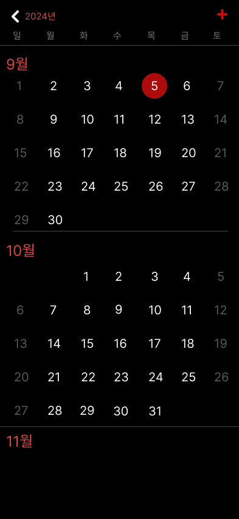
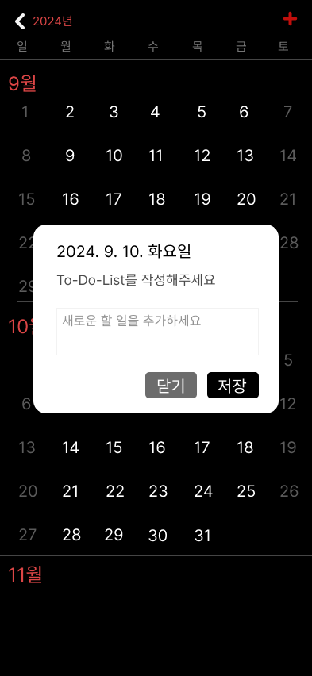
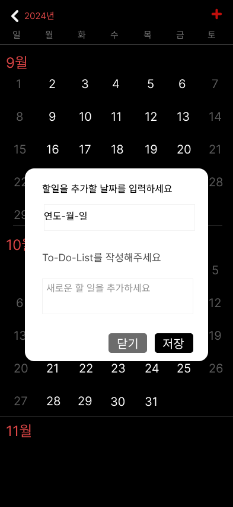
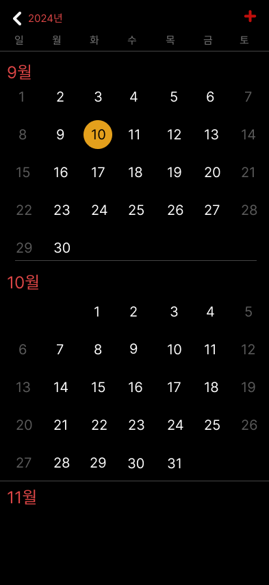
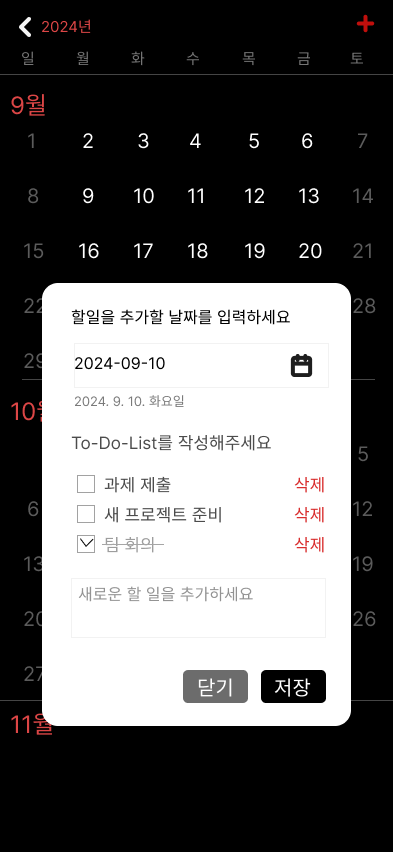

 # Todo + Calendar App

## 간략 설명

**Calendar**와 **Todo-List** 기능을 한 곳에서 제공하는 모바일/데스크탑 반응형 캘린더 웹/애플리케이션입니다.

<a href="https://todolistcalendar.vercel.app/" target="_blank">**https://todolistcalendar.vercel.app/**</a>를 통해 직접 사용해볼 수 있습니다.

### Calendar

- 무한 스크롤을 통해 이전 달, 다음 달을 탐색할 수 있습니다.
- 한 해가 지나가면 상단의 연도 표시는 자동으로 변경됩니다.
- 하단의 **현재** 버튼을 눌러 현재 날짜에 맞는 달력을 보여줍니다.

### Todo-List

- 특정 날짜를 직접 선택하여 일정을 작성할 수 있습니다.
- **+** 버튼을 통해 원하는 날짜에 일정을 추가할 수 있습니다.
- 팝업창을 통해 완료한 일정을 표시하거나 삭제할 수 있습니다.
- 모든 일정을 완료하고 삭제하면, 달력에서 해당 날짜의 이벤트 표시는 사라집니다.

### 디자인

개인적으로 깔끔하고 직관적인 **Iphone calendar** 디자인을 참고하여<br/>
사용자가 쉽게 탐색할 수 있도록 개발하였습니다.<br/>

**사용한 CSS 라이브러리**

- TailwindCSS : 유틸리티 클래스 기반 CSS 프레임워크.
  HTML 태그에 유틸리티 클래스를 추가하여 스타일링 했습니다.
  빠른 스타일링으로 짧은 기간 안에 디자인을 할 수 있었으며
  가독성이 떨어지는 단점이 있지만 반응형 디자인을 쉽게 구현할 수 있는 장점으로 사용했습니다.

## 와이어프레임

<a href="https://www.figma.com/design/JWiJVK0EDodMaKGEcWr15d/clush-%EA%B3%BC%EC%A0%9C_%EC%BA%98%EB%A6%B0%EB%8D%94%2B%EC%9D%BC%EC%A0%95?node-id=0-1&t=T1Wvheiu9En3iwKT-1" target="_blank">**Figma 와이어프레임 링크**</a>

### 캘린더 기본 화면



### 날짜를 직접 선택 시 화면



### + 버튼을 통해 자유로운 날짜 입력 화면



### 입력된 일정이 날짜에 표시되는 화면



### ToDo-List를 작성한 후의 완료 표시와 삭제 버튼 화면



## 소스 빌드 및 실행 방법

### 1. 요구 사항

- Node.js : v20.10.0
- npm : v10.8.3

### 2. 설치 및 실행

1. 프로젝트 클론

   ```bash
   git clone <https://github.com/Luison1472/Todo_Calendar_0910.git>
   ```

2. 의존성 설치

   ```bash
   npm install
   ```

   **_npm install -D tailwindCSS (npm install 후 tailwindCSS 설치 오류일시)_**

3. 개발 서버 실행
   ```bash
   npm run dev
   ```

---

### 3. 주력으로 사용한 컴포넌트에대한 설명 및 사용 이유

**MonthView.jsx & calendar.jsx**<br/>
이 두 컴포넌트들을 주력으로 사용.<br/>

1. **MonthView.jsx**<br/>

 - **getMonthDays 함수를 통해 해당 월의 첫 번째 날짜가 시작하는 요일과 총 일수를 계산.**

  사용 이유 => 달력의 기본적인 레이아웃을 만들며 특정 월의 날짜를 정확히 렌더링 할 수 있도록 함.

 - **isToday 함수를 통해 오늘 날짜 강조.**

  사용 이유 => && 연산자를 통해 현재 날짜를 비교하고 빨간 배경으로 강조 할 수 있도록 하였음.

 - **onDateClick 날짜 클릭 이벤트 추가.**

  사용 이유 => 특정 날짜를 클릭하면 ondateClick 함수가 호출되며, 선택된 날짜에 관한 일정을 추가할 수 있도록 팝업창이 나오도록 사용하기 위해 사용한 함수.

2. **Calendar.jsx**<br/>

 - **여러 개의 월 단위 달력(MonthView 컴포넌트) 관리.**

  사용 이유 => 코드 가독성과 유지 보수의 편안함을 위해 따로 관리 하였음.

 - **수동 스크롤 이벤트를 통해 일정들을 무한으로 탐색할 수 있도록 구현.**

  사용 이유 => 수 많은 달력을 한번에 로드하는 대신, 필요한 달만 동적으로 로드하여 성능 최적화.

 - **useInperativeHandle로 오늘 날짜 스크롤 이동 기능 구현.**

  사용 이유 => useRef를 통해 Calendar 컴포넌트를 외부에서도 참조 할 수 있도록 하였으며, scrollToToday 함수를 호출하면 자동으로 현재 날짜가 포함된 월로 스크롤 이동을 할 수 있음.

 - **onDateClick 콜백 전달.** <br/>
  사용 이유 => 날짜 클릭 시 팝업을 띄우거나, 일정을 추가하는 등의 동작을 쉽게 처리할 수 있도록 onDateClick 콜백을 MonthView에 전달하는 방식 사용.

## 구현 이슈 및 해결 방법

### 1. 수동 스크롤 이벤트 사용 이유

- **배경**:<br/> 처음엔 **Intersection Observer API**를 통해 구현할 예정이었으나,<br/> 이 API는 특정 화면 지점을 기준으로 **%** 비율을 통과할 때 렌더링하는 방식.<br/>
- **문제**:<br/> 무한 캘린더의 구조에서는 과거, 현재, 미래를 계속 탐색해야 하므로,<br/> 최상단 및 최하단에 특정 포인트를 두면 무한 루프에 빠지는 문제 발견.<br/>
- **해결**:<br/> 수동으로 스크롤 이벤트를 지정하여, <br/>최상단 + 최하단으로 스크롤할 때마다 필요한 달력만 렌더링하는 방식으로 **무한 루프** 버그를 해결.<br/>

### 2. 스크롤 튕김 현상

- **문제**:<br/> 수동 스크롤 이벤트를 통해 무한 스크롤을 구현하였으나,<br/> 스크롤이 최상단 또는 최하단으로 이동할 때마다 새로운 달력이 렌더링되면서 전체 콘텐츠의 높이가 변동.<br/>
  이로 인해 뷰포트가 위아래로 흔들리며 튕기는 현상이 발생함.<br/>
- **해결**:<br/> `useRef`로 참조된 `calendarRef`를 통해 `scrollTopBefore` 값에 `(scrollHeightAfter - scrollHeightBefore)`를 더해주어,<br/>
  변동된 스크롤 높이만큼 스크롤 위치를 조정, 이로써 자연스러운 스크롤 조정이 가능.
